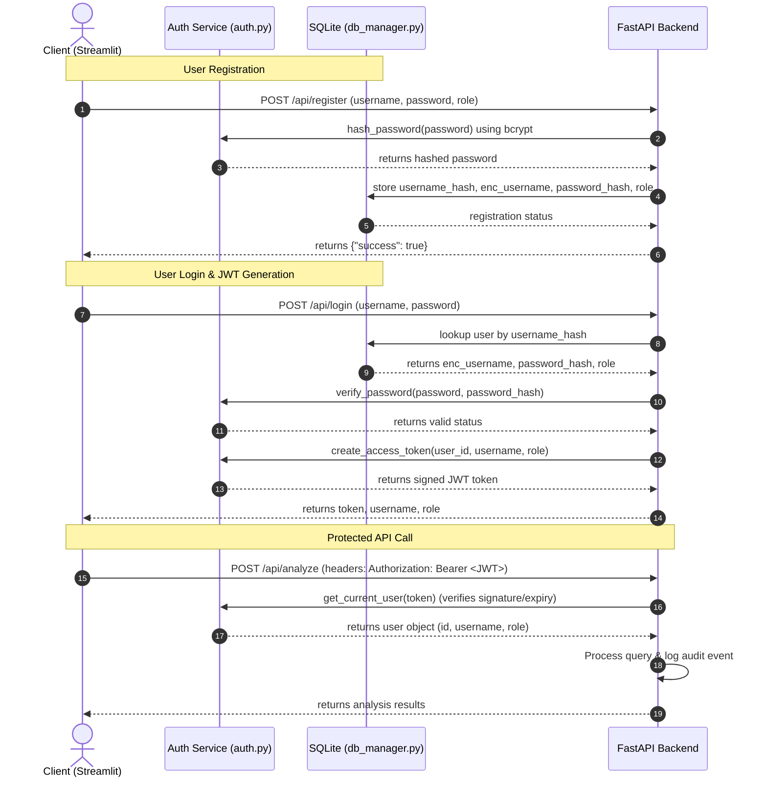
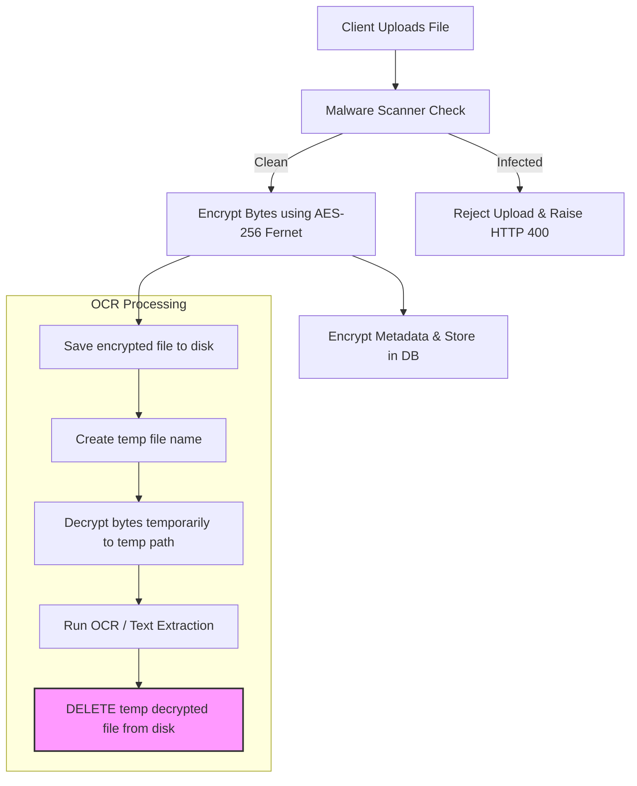

# Enterprise-Grade Security Architecture

The Indian Legal Advisor platform includes comprehensive security controls to protect client information, user authentication, and data integrity.

---

## 🏗️ Directory Structure of Security Components

```text
├── .env                              # Global secret keys, database paths, and SSL configs
├── requirements.txt                  # Python package specifications (cryptography, bcrypt, pyjwt)
├── doc/
│   └── SECURITY.md                   # This security architecture document
├── frontend/
│   └── app.py                        # Streamlit UI with login gates and bearer headers
└── src/
    ├── main.py                       # Uvicorn server launcher with HTTPS support
    ├── api/
    │   ├── auth.py                   # Bcrypt password hashing & JWT generation/verification
    │   └── routes.py                 # Protected REST routes with rate-limiting & security headers
    └── utils/
        ├── crypto_helper.py          # AES-256 Fernet data encryption & decryption
        ├── db_manager.py             # SQLite encrypted DB storage & audit logging manager
        ├── malware_scanner.py        # Windows Defender wrapper & magic bytes validator
        └── rate_limiter.py           # Sliding-window API rate limiter dependency
```

---

## 🔑 User Authentication & JWT Flow

Authentication is built using secure `bcrypt` hashing for passwords and signed `JSON Web Tokens (JWT)` for stateless endpoint access control.



---

## 🔒 Encryption & Data Protection Flow

All uploaded files (PDFs and images) and sensitive columns in the SQLite database (such as names, file paths, and audit details) are encrypted using **AES-256** symmetric encryption via `cryptography.fernet`.



> [!IMPORTANT]
> **Temporary File Cleanup:** The temporary decrypted copy is wrapped inside python `try ... finally` blocks to ensure that the unencrypted copy is deleted from the server filesystem immediately after OCR processing, even if extraction errors occur.

---

## 👥 Role-Based Access Control (RBAC)

The system supports two distinct roles:

| Feature / Permission | User | Admin |
| :--- | :---: | :---: |
| Legal Query Advisory | ✅ | ✅ |
| FIR Document Analysis | ✅ | ✅ |
| Legal Notice Analysis | ✅ | ✅ |
| Interactive Case Chat | ✅ | ✅ |
| View Own Upload History | ✅ | ✅ |
| View All Uploaded Documents | ❌ | ✅ |
| View All Registered Users | ❌ | ✅ |
| View System Audit Logs | ❌ | ✅ |
| Manage User Roles / Accounts | ❌ | ✅ |

---

## 📋 Security Audit Logging

The backend database records an audit log for every transaction. All records are stored with the username encrypted, ensuring that user identity remains hidden from raw database queries.

### Database Schema (`audit_logs`)
- `id` (INTEGER PRIMARY KEY)
- `timestamp` (TEXT, ISO-8601 representation)
- `enc_username` (TEXT, AES-256 encrypted username)
- `user_role` (TEXT, plain-text role)
- `ip_address` (TEXT, plain-text client IP address)
- `action` (TEXT, plain-text description of transaction)
- `endpoint` (TEXT, plain-text route called)
- `status` (TEXT, success/partial_success/error/unauthorized)
- `processing_time` (REAL, transaction time in seconds)

---

## 🛡️ Anti-Malware Scanning & File Validation

Before processing any file, the backend runs file-level validation and malware inspection:

1. **Size Enforcement:** Files exceeding `10MB` are rejected.
2. **File extension & Magic Bytes validation:** Checked against magic headers to reject renamed files:
   - PDF: starts with `%PDF`
   - PNG: starts with `\x89PNG`
   - JPG/JPEG: starts with `\xff\xd8`
   - Automatically rejects files starting with `MZ` (Windows executables) or `\x7fELF` (Linux binaries) to block script/binary uploads.
3. **Windows Defender scan:** If `MpCmdRun.exe` is found at `C:\Program Files\Windows Defender\MpCmdRun.exe`, the file is scanned by running Defender via `subprocess`:
   ```bash
   MpCmdRun.exe -Scan -ScanType 3 -File "<file_path>"
   ```
   If a threat is detected (exit code 2 or signature flags in output), the file is rejected immediately with a clean error message. If Defender is not present, a fallback heuristic signature check runs.

---

## 🌐 API Security & Headers

FastAPI routes enforce security constraints on every request:

1. **Rate Limiting:** Global rate limit dependency enforces a maximum of `20 requests per minute` per client IP or authenticated user, returning `429 Too Many Requests` when exceeded.
2. **Security Headers Middleware:** Sets custom security headers on all responses:
   - `X-Content-Type-Options: nosniff`
   - `X-Frame-Options: DENY`
   - `X-XSS-Protection: 1; mode=block`
   - `Content-Security-Policy: default-src 'self'; frame-ancestors 'none';`
   - `Strict-Transport-Security: max-age=31536000; includeSubDomains` (HSTS)
3. **CORS Configuration:** Enables origin configuration.

---

## ⚙️ Environment Variables Reference (`.env`)

Verify that the following configurations are added:

```ini
# Cryptographic Secrets
JWT_SECRET=e2c637dc3181d5e5c3731929862bf6e0ee3f44e33ee099d3599a0df292e155a0
ENCRYPTION_KEY=RTvWb4G9tEMLej5DfW5xNvufXVjP735X23rVt9kfRR8=

# Database Settings
DATABASE_URL=data/legal_advisor.db

# API Rate Limits
RATE_LIMIT_RPM=20

# SSL / HTTPS Configuration
SSL_ENABLED=False
SSL_CERTFILE=
SSL_KEYFILE=
```

---

## 🚀 Setup & Launch Instructions

### 1. Install Dependencies
```bash
pip install -r requirements.txt
```

### 2. Launch FastAPI Backend
For HTTP local development:
```bash
python src/main.py
```
For HTTPS deployment, update `.env`:
```ini
SSL_ENABLED=True
SSL_CERTFILE=certs/server.crt
SSL_KEYFILE=certs/server.key
```
Then run the server launcher.

### 3. Launch Streamlit Frontend
```bash
streamlit run frontend/app.py
```
Upon launching, sign up an account (e.g. choose `Admin` role to access the admin command console) and log in.
